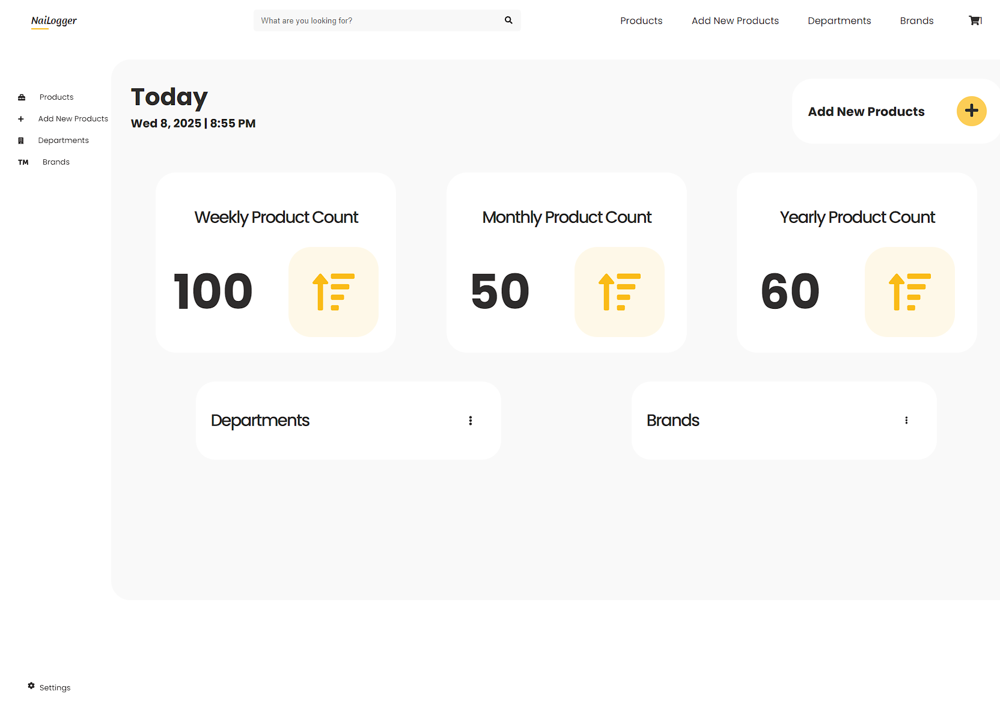

# 🛠️ Nailogger - Sample CRUD App

Welcome to the **Nailogger** App! This is a full-stack application built using React and Context API on the frontend and a backend server with a database for handling data. This app allows you to perform Create, Read, Update, and Delete (CRUD) operations seamlessly.



---

## 🌟 Features

### Frontend:

- **React** for dynamic and interactive user interfaces.
- **Context API** for state management across components.
- **Components**:
  - **Products**: View and manage the product list.
  - **Add New Products**: Add new items to the product catalog.
  - **Departments**: Browse and organize products by departments.
  - **Brands**: Manage vendor and brand information.

### Backend:

- A server with a database containing:
  - `departments`: Information about product categories.
  - `products`: Details about all products.
  - `vendors`: Data on brands and suppliers.
  - `checkout`: Records of purchase transactions.

---

## 🚀 Installation & Setup

### Prerequisites:

- Node.js installed on your machine.
- Git for cloning the repository.

### Steps:

1. **Clone the Repository**:
   ```bash
   git clone https://github.com/your-repo-url.git
   cd your-repo-folder
   ```

## 🗂️ Folder Structure

- **Server:**
  - server/db/departments.json: Departments data.
  - server/db/products.json: Product data.
  - server/db/vendors.json: Vendor and brand data.
  - server/db/checkout.json: Checkout transactions.
- **Client**
  - client/src/components/Products.js: Product list and - details.
  - client/src/components/AddNewProduct.js: Form for adding new products.
  - client/src/components/Departments.js: Manage and view departments.
  - client/src/components/Brands.js: Vendor and brand management.

## 📖 Usage

- **Products**:

  - View the product catalog.
  - Add new products using the Add New Products form.
  - Update or delete existing products.

- **Departments**:
- Organize products by categories.
- Add, edit, or delete department details.

- **Brands:**
- Manage brand and vendor information.
- Link vendors to products.

- **Checkout:**
  - Track purchase transactions.
  - View and manage checkout records.

## 🛡️ Technologies Used

- **Frontend:**

  - React
  - Context API
  - CSS for styling

- **Backend:**
  - Node.js
  - Express.js
  - JSON files to simulate database (can be upgraded to an actual database like MongoDB or PostgreSQL in the future).

Happy Coding! 🎉
